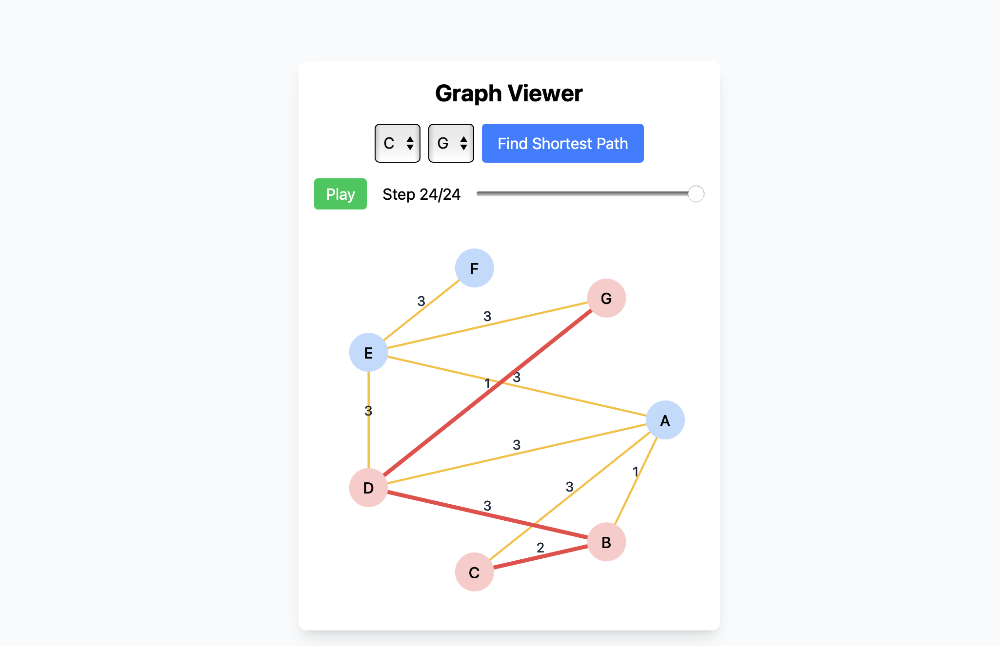

# React.js + Vite Dijkstra Simulator

This project demonstrates the use of React.js and Vite to create an interactive and visually appealing simulation of Dijkstra's shortest path algorithm. It is designed to help users understand the algorithm's mechanics through an intuitive interface and real-time updates. 

## Get Started

1. Clone Repo `git clone https://github.com/notKeion/CSC-340-Final`
2. Open project `cd CSC-340-Final`
2. Install Dependencies with `npm install`
3. Run Development Branch `npm run dev -- --host --port 8000`

## Authors
- Keion Vergara
- Reagan Tullis
- Fereydoun Memarzanjany

## License
> MIT: Open Source
